# Crowdfunding_ETL
 Builded an ETL pipeline using Python, Pandas, Python dictionary methods and regular expressions to extract and transform the data. Created four CSV files and use the CSV file data to create an ERD and a table schema. Finally, uploaded the CSV file data into a Postgres database. It involves extracting data from multiple sources, cleaning and transforming the data using Jupyter Notebook with pandas, numpy, and datetime packages, and loading the cleaned data into a relational database using pgAdmin.    

# Extract, Transform and Load the Crowdfunding Data

Hey, let's play with "Crowdfunding" data files and win the Data Science by extracting completely, transforming appropriately and loading in the PgAdmin engine as Postgres database.

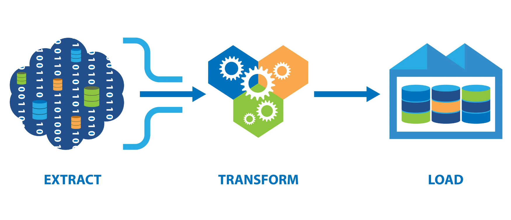

### Introduction 

Current trends in the world of economic funding and investment have revealed exponential growth with regard to crowdfunding. Crowdfunding works by taking small sums of capital from a variety of people in order to fund up and coming business ideas and projects. Crowdfunding campaigns have proven to be very successful by raising funds without the upfront fees.

This ETL process for 'Crowdfunding' data break into two deliverables.

Deliverable 1: Extract & Transform Using Jupyter Notebook.

Deliverable 2: Load the data to Postgres Database.

# Deliverable 1: Extract & Transform Using Jupyter Notebook

### 1.1 Prerequisites

Before you begin, ensure you have the following installed:

- Python 3.6 or higher
- Numpy 
- JSON
- Pandas (for data analysis)

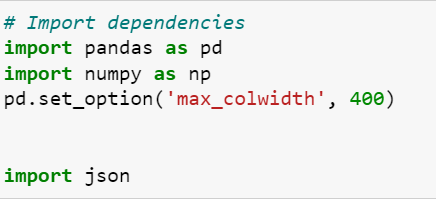

### 1.2 Data Sources

We get the data resources from two files 'crowdfundig.xlsx' and 'contacts.xlsx' using Pandas.

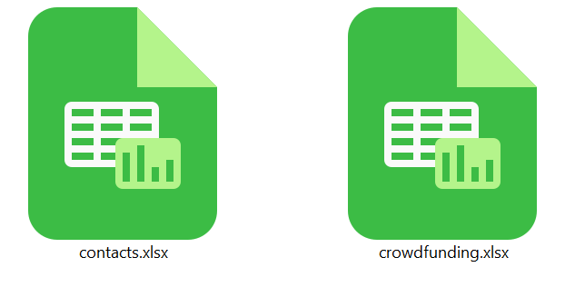

### 1.3 Create the Category and Subcategory DataFrames

Extract and transform the crowdfunding.xlsx data to create a 'crowdfunding_info_df' DataFrame.

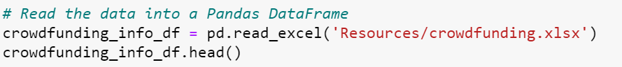

Check the columns names to confirms before splitting the values.

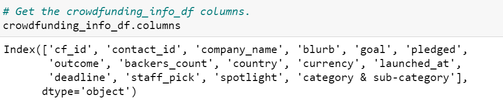

Split each "category & sub-category" column value into "category" and "subcategory"

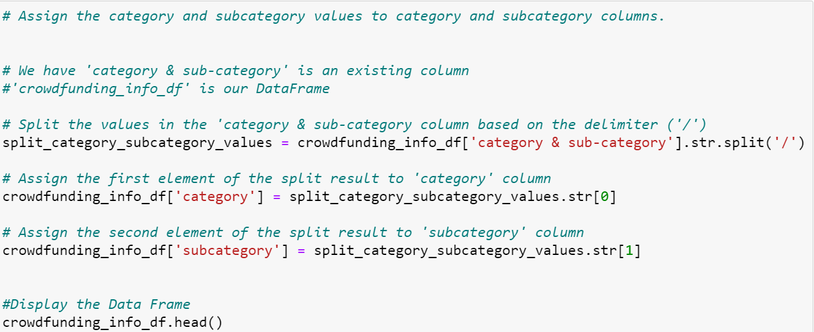

Review to check the names and confirm how much categories and subcategories exists.

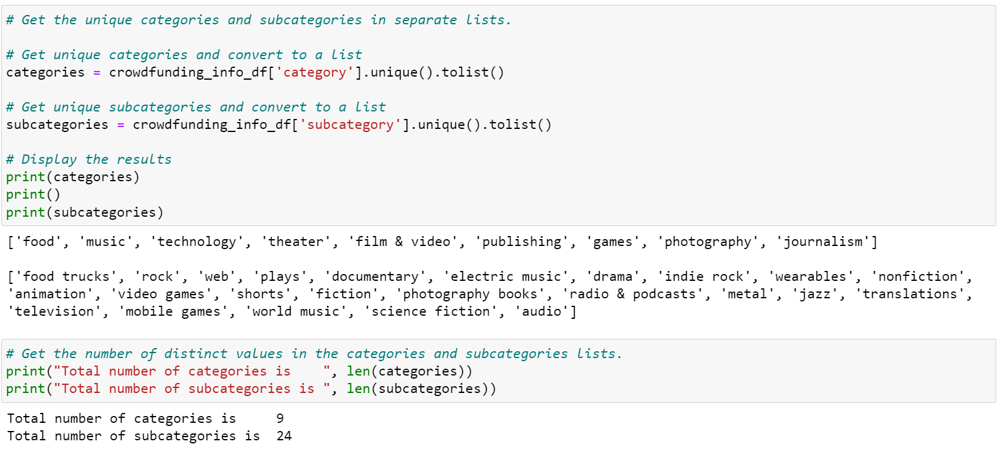

To create the category and subcategory identification numbers, use a list comprehension to add the "cat" string or the "subcat" string to each number in the category or the subcategory array, respectively.

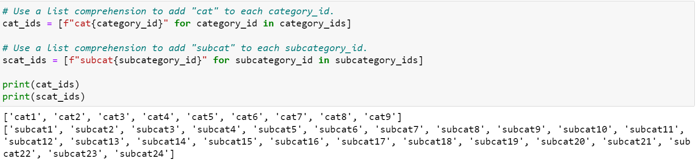

Create the category DataFrame as 'category_df' and subcatgeory DataFrame as 'subcategory_df'.

Show the 'category_df' DataFrame with top five rows.

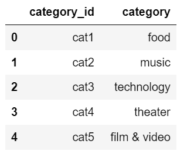

Show the 'subcategory_df' DataFrame with top five rows.

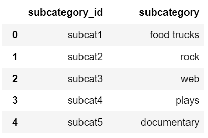

Export the category DataFrame as category.csv and the subcategory DataFrame as subcategory.csv.

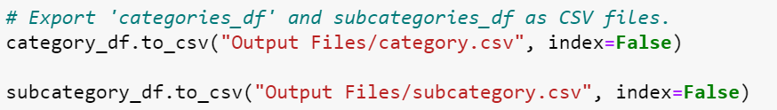

### 1.4 Create the Campaign DataFrame

Create a copy of the 'crowdfunding_info_df' to transform the crowdfunding.xlsx data.

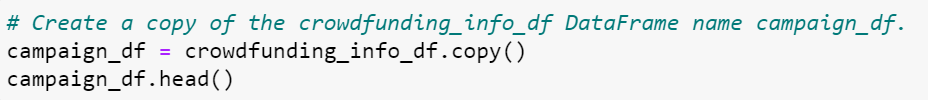

Rename the specific columns and sets their appropriate data types for 'campaign_df' DataFrame. 

Convert the 'launched_date' and 'end_date' columns to UTC datetime format.

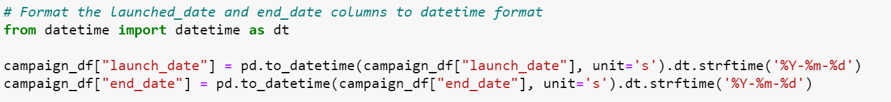

Drop the unwanted columns for campaign DataFrame.

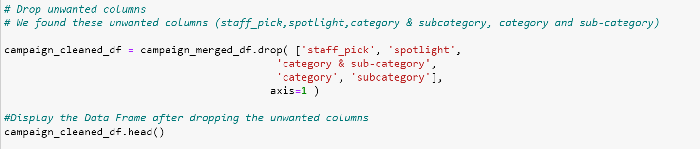

Confirm the number of columns after dropping in the DataFrame and then export the campaign DataFrame as campaign.csv.

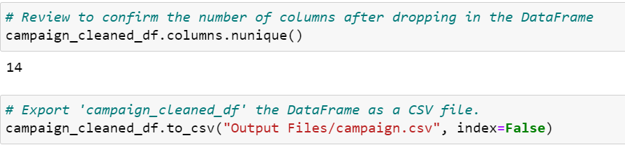

### 1.5 Create the Contacts DataFrame ( Using Python Dictionaries)

Extracting and transforming the data from the 'contacts.xlsx' excel data.

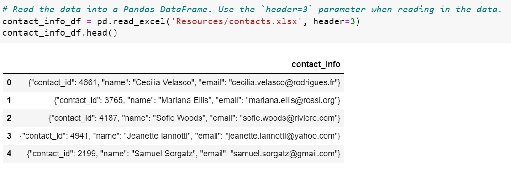

Iterate through the 'contact_info_df' DataFrame to get the data values of all rows in a list.

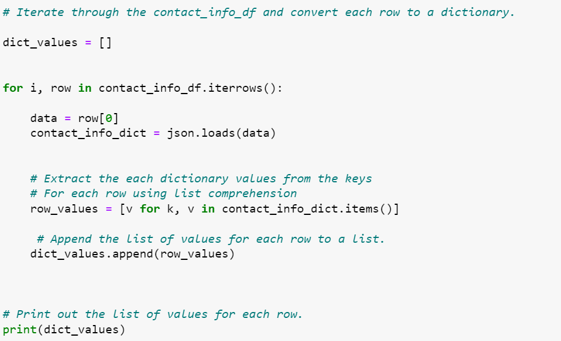

Create a 'new_contact_info_df' DataFrame for contacts data.

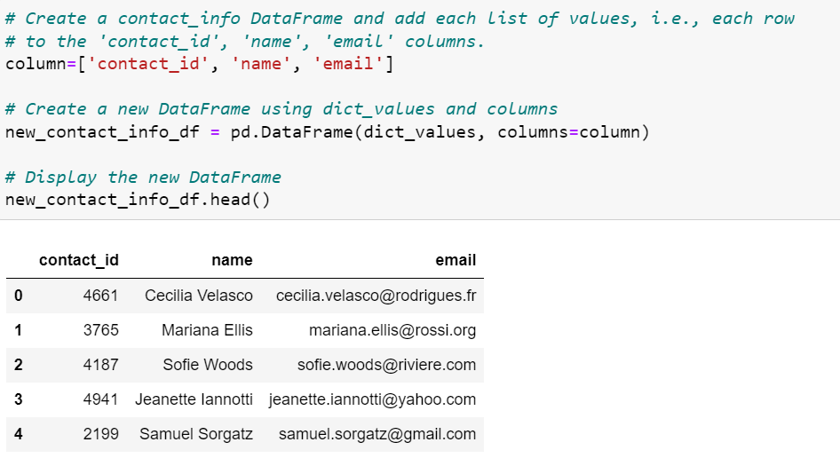

Split each "name" column value into a first and last name, and place each in a new column.

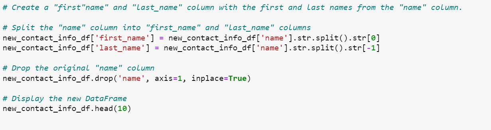

Reorder the columns and Display the new DataFrame i.e. 'new_contact_info_df' with first ten rows.

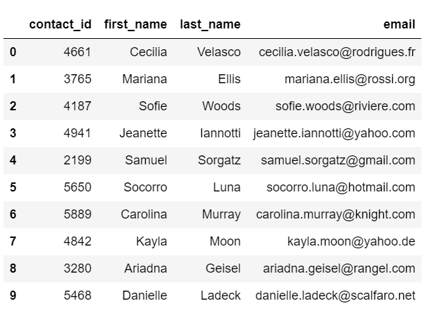

Export the 'new_contact_info_df' DataFrame as contacts.csv.

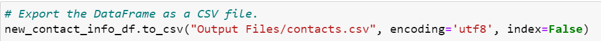

### 1.6 Create the Contacts DataFrame ( Using Regular Expression)

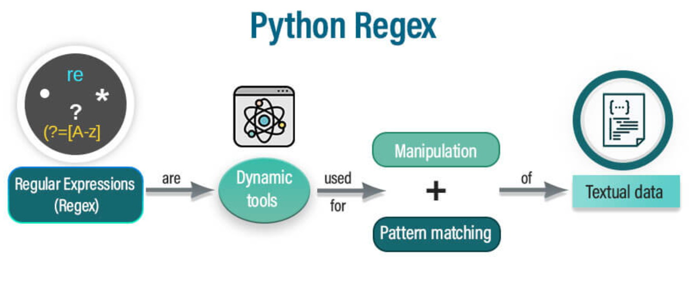

Extracting and transforming the data from the 'contacts.xlsx' excel data into 'regex_contact_info_df' DataFrame.

Extract the four-digit contact ID number. Extract the "contact_id", "name", and "email" columns by using regular expressions.

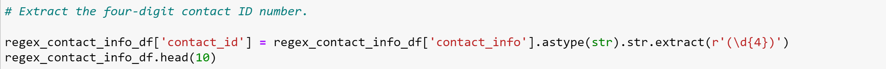

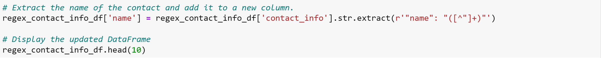

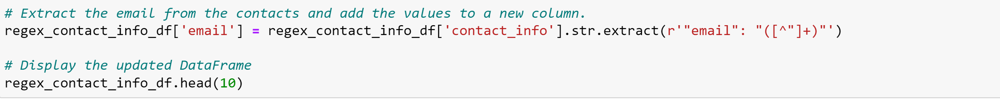

Create a new copy of the 'regex_contact_info_df' with the 'contact_id', 'name', 'email' columns.

Split each "name" column value into a first and a last name, and place each in a new column.

Display the created 'new_regex_contact_info' DataFrame with first ten rows.

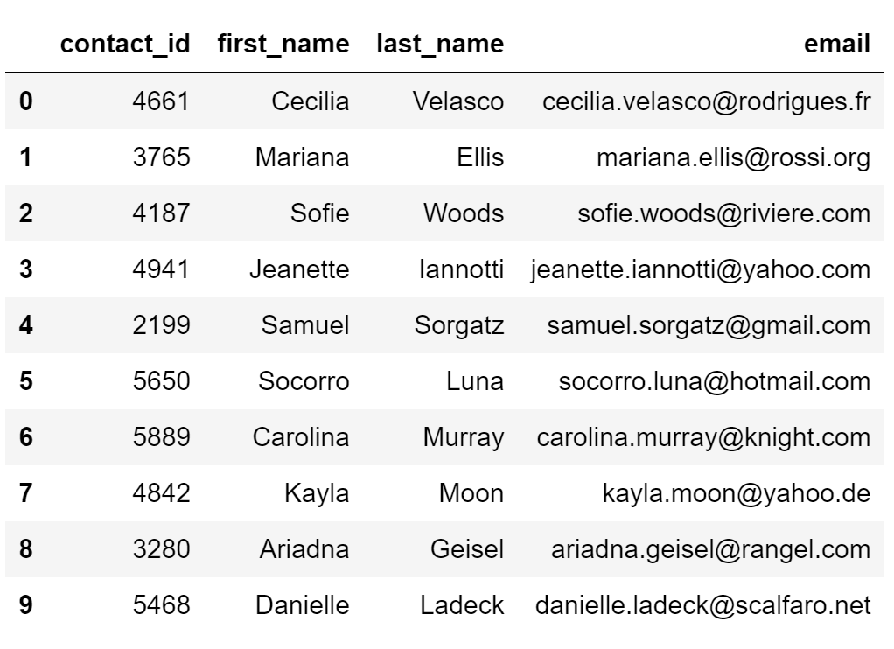

Export the 'new_regex_contact_info' DataFrame as regex_contacts.csv

## Author

## [Jalees Moeen GitHub](https://github.com/JaleesMoeen)

## [Maira Syed GitHub](https://github.com/mairasyed)
